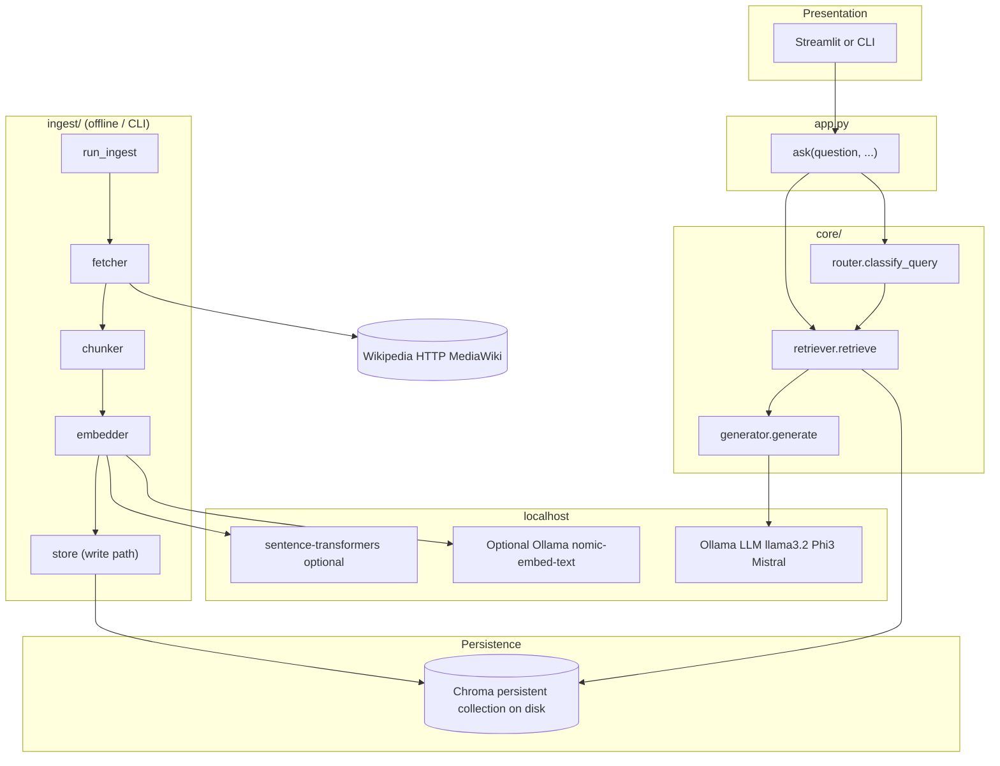

# System Architecture — Local Wikipedia RAG Assistant

**Maintainer:** Architect Agent (outputs per [`agents/architect_agent.md`](../agents/architect_agent.md))  
**Requirements source:** [`product_prd.md`](../product_prd.md)

This document is the implementation source of truth for the Backend Agent, query surface for the UI Agent, and test oracle for the QA Agent. It defines structure and contracts only—not executable code.

---

## Explicit interpretations

1. **“Language-native HTTP”** means outbound Wikipedia access via Python **`urllib.request`** only—no third-party HTTP clients (`requests`, `httpx`) and no scraping frameworks (`beautifulsoup4`, `scrapy`). Using **`html.parser`** (stdlib) or JSON parsing from stdlib responses is allowed when converting responses to plaintext.
2. **Wikipedia access** is logically “fetch canonical article plaintext over HTTP”; a typical concrete choice is **MediaWiki Action API** returning JSON (**still HTTP**, no scraping library).
3. **Chat UX**: Streamlit **or** CLI; orchestration exposes **`ask(...)`** in `app.py` as the stable contract. Optional **`return_sources`** satisfies transparency (PRD U‑3).
4. **`ask` scope**: **Single-turn RAG per call** unless a future revision adds **`conversation_history`**. Conversation reset is UI/session-only (PRD U‑4).

---

## 1. Component diagram

High-level layering: presentation → orchestration (`app.py`) → RAG core → persisted Chroma + localhost models. Wikipedia remains the corpus source fetched over HTTP; LLM/embeddings stay local (PRD §4).



### Module ownership

| Module | Responsibility |
|--------|----------------|
| **`ingest/fetcher`** | HTTP fetch; canonical URL; plaintext suitable for chunking |
| **`ingest/chunker`** | Large Wikipedia pages → bounded chunks |
| **`ingest/embedder`** | Local embeddings; batching |
| **`ingest/store`** | Chroma client; collection; disk persistence path; upserts |
| **`core/router`** | Classify query: **person** / **place** / **both** |
| **`core/retriever`** | Metadata-filtered similarity retrieval |
| **`core/generator`** | Prompt assembly; Ollama completion |
| **`app.py`** | Wire router → retriever → generator; paths, **`k`**, model names |

---

## 2. API contracts per module

Types below are logical (dataclass / TypedDict equivalent); backends choose concrete Python types without changing semantics.

### Shared conceptual types

```text
EntityType = Literal["person", "place"]
RouteLabel = Literal["person", "place", "both"]

RouteDecision:
  label: RouteLabel

ArticleFetchResult:
  wikipedia_title: str
  canonical_url: str
  plaintext: str

ChunkRecord:
  text: str
  chunk_id: str               # deterministic; recommended slug(entity, stem, ordinal)
  entity_name: str
  entity_type: EntityType
  source_url: str
  chunk_index: int
  section_title: str           # "__LEAD__" for intro before first == section ==
```

```text
RetrievedChunk:
  text: str
  metadata: dict               # conforms to Metadata schema §4
  distance: float

GenerationResult:
  answer_text: str
  retrieved_chunks: list[RetrievedChunk]
  route_label: RouteLabel
```

```text
IngestEmbedderConfig:
  backend: Literal["ollama_nomic", "sentence_transformers"]
  model_name: str
  batch_size: int

ChromaStoreConfig:
  persist_directory: str
  collection_name: str
```

### `ingest/fetcher.py`

```text
fetch_wikipedia_plaintext(title: str, language: str = "en") -> ArticleFetchResult
  Raises:
    WikipediaHTTPError       — non-200, timeouts, malformed API envelope
    ArticleNotFoundError     — missing page; disambiguation page treated as ingest failure

normalize_title_for_url(title: str) -> str
```

### `ingest/chunker.py`

```text
chunk_article(plaintext: str, entity_name: str, entity_type: EntityType, source_url: str) -> list[ChunkRecord]
```

### `ingest/embedder.py`

```text
embed_texts(texts: list[str], config: IngestEmbedderConfig) -> list[list[float]]
  Preconditions: non-empty texts; each non-empty after strip
  Postcondition: len(out) == len(texts); vector dims match chosen model
```

### `ingest/store.py`

```text
ensure_collection(config: ChromaStoreConfig, embedding_dimension: int) -> None

upsert_chunks(
  config: ChromaStoreConfig,
  ids: list[str],
  embeddings: list[list[float]],
  documents: list[str],
  metadatas: list[dict],
) -> None
  Constraints: aligned lengths; ids globally unique across runs

collection_stats(config: ChromaStoreConfig) -> dict[str, int]
```

### `core/router.py`

```text
classify_query(query: str) -> RouteDecision
```

### `core/retriever.py`

```text
retrieve(
  query: str,
  route: RouteDecision,
  chroma_config: ChromaStoreConfig,
  embedder_config: IngestEmbedderConfig,
  k: int,
) -> list[RetrievedChunk]
```

Filters:

```text
label == person  → metadata entity_type == "person"
label == place   → metadata entity_type == "place"
label == both    → no entity_type filter
```

**Tie-break** when distances collide: prefer lower **`chunk_index`**, then lexical **`chunk_id`** order.

Query embedding **must use the same backend, model name, and text normalization** as ingestion.

### `core/generator.py`

```text
generate(
  query: str,
  chunks: list[RetrievedChunk],
  ollama_model: str,
  ollama_host: str = "http://127.0.0.1:11434",
  temperature: float = 0.1,
  max_tokens: int,
) -> str
```

Returns **`answer_text` only**; `app.py` composes **`GenerationResult`**.

### `app.py`

```text
ask(
  question: str,
  *,
  k: int = 5,
  return_sources: bool = True,
) -> GenerationResult
```

If Chroma is missing or empty, surface a deterministic error to callers (implementation detail: exception type/message).

### `ingest/run_ingest.py`

```text
run_ingestion(
  *,
  chroma_config: ChromaStoreConfig,
  embedder_config: IngestEmbedderConfig,
  entity_specs: list[tuple[str, EntityType]],
) -> dict[str, int]
```

`entity_specs` must satisfy PRD I‑1 / I‑2 minima plus required names; failures per title logged in returned stats.

---

## 3. Chunking strategy with rationale

### Design goals

- **PRD C‑2 (large docs):** Preserve topical locality via **structure-first** splitting (Wiki `== Heading ==`), not only naive fixed windows across the entire article.
- **Retrieval quality:** Homogeneous sections reduce irrelevant neighbors in embedding space.
- **Boundary loss:** Controlled **overlap** avoids cutting answers spanning two windows.

### Pre-chunk normalization

Strip transport noise only; normalize whitespace. Preserve recognizable **level‑2 headings** as split signals (lines fitting `^== ... ==$` conventions).

### Primary split — section-aligned

Segments are contiguous blocks bounded by **level‑2** wiki headings.

- **`section_title`**: trimmed heading text; **`__LEAD__`** for content before the first heading.
- Heading text may optionally be echoed inside **`text`**; if not, **`section_title` metadata carries the label.

### Secondary split — bounded windows + overlap

| Parameter | Value | Rationale |
|-----------|-------|-----------|
| `TARGET_CHARS` | **1100** | Strong recall/latency tradeoff vs typical embedder receptive fields |
| `HARD_CAP_CHARS` | **1600** | Safety valve for dense lists and timelines |
| `OVERLAP_CHARS` | **150** | Bridge facts spanning boundaries |
| `MIN_CHARS_BEFORE_MERGE` | **280** | Avoid tiny low-signal chunks |

Algorithm per segment:

1. If **`len(section) ≤ TARGET_CHARS`**: emit one chunk unless below **`MIN_CHARS_BEFORE_MERGE`**, then merge with the next adjacent short segment until threshold or **`HARD_CAP`** forces a split.
2. If **`len(section) > TARGET_CHARS`**: split preferring separators: `\n\n` → `\n` → `. ` → space-hard cut.
3. **Overlap:** after each emitted window (except last), rewind **`OVERLAP_CHARS`** (respect UTF‑8 boundaries).

### Special cases

| Case | Handling |
|------|----------|
| Disambiguation page | **`fetch`** errors; never chunk |
| Dense tables/lists | Recursive separator still respects **`HARD_CAP`** |
| Very short stubs | Merge short segments aggressively |

Embedded **`documents`** in Chroma equal **`ChunkRecord.text`**; grounding does not substitute metadata for body text (**PRD G‑2**).

---

## 4. Metadata schema for Chroma chunks

Chroma persists scalar-friendly metadata—use flattened strings/explicit ints consistently.

### PRD-required (I‑3)

| Field | Type stored | Constraints |
|-------|-------------|-------------|
| `entity_name` | `str` | Non-empty curated display/key |
| `entity_type` | `str` | Exactly **`person`** or **`place`** |
| `source_url` | `str` | Canonical HTTPS Wikipedia URL |

### Recommended

| Field | Type | Purpose |
|-------|------|---------|
| `chunk_index` | `int` | Monotonic ingestion order |
| `section_title` | `str` | May be **`__LEAD__`** |
| `wikipedia_title` | `str` | API-resolved article title vs display **`entity_name`** |
| `chunk_id` | `str` | Same as preferred Chroma **`id`** |

### Operational

| Field | Type | Purpose |
|-------|------|---------|
| `ingest_run_id` | `str` | Batch UUID |
| `embedder_signature` | `str` | E.g. `ollama:nomic-embed-text` — mismatched vectors forbidden |

Mapping:

```text
Chroma.id          := chunk_id
Chroma.document    := chunk text (ChunkRecord.text)
Chroma.embedding   := embed(document)
Chroma.metadata    := { all fields above compatible with storage }
```

---

## 5. Query routing rules (`core/router`)

Map to **`RouteDecision.label`** ∈ **`person` \| `place` \| `both`**.

### Preprocess

Lowercase → strip → collapse whitespace. Tokenize alphanumeric (Unicode letters retained). Phrase boosts may use token bigrams (**implementation flexibility**).

### Scoring counters

Maintain **`S_person`** and **`S_place`**.

**A. Strong nouns (+2 each hit)**

*Place-ish:* `where`, `location`, `located`, `mountain`, `river`, `canyon`, `landmark`, `monument`, `building`, `temple`, `pyramid`, `tower`, `statue`, `bridge`, `cathedral`, `mosque`, `museum`, `site`, `geography`, `country`, `city`, `capital`, `island`, `peak`, `summit`, `wall`, `ruins`, `park`, `unesco`

*Person-ish:* `who`, `biography`, `born`, `died`, `nobel`, `composer`, `painter`, `scientist`, `inventor`, `philosopher`, `writer`, `author`, `artist`, `athlete`, `football`, `soccer`, `singer`, `actor`, `actress`, `politician`, `queen`, `king`, `emperor`, `president`

**B. Lightweight geographic spill (+1)** for tokens like `in`, `near`, `north`, `south`, `east`, `west`, `border`, `elevation`, `altitude` **only when** either a **(+2)** place cue hit exists **or** a configured **known place substring** (PRD corpus) matched.

**C. Lightweight person cues (+1)** for tokens like `discovered`, `invented`, `won`, `award`, `team`, `album`, `film` when **`who`** or person-like framing co-occurs.

### Pattern boosts

| Pattern | Adjustment |
|---------|-------------|
| Starts with **`who is` / `who was` / `who's`** | `S_person += 3` |
| Starts with **`where is` / `where was` / `where are`** | `S_place += 3` |
| **`which country`** / **`which city`** | `S_place += 2` |
| **`which scientist`** / **`which writer`** / **`which player`** | `S_person += 2` |

### Corpus dictionary boost (recommended)

Substring match (case-insensitive) against configured **PLACE_NAME** aliases → **`S_place += 2`**; **PERSON_NAME** aliases → **`S_person += 2`**. Names come from PRD required lists plus normalized aliases (**Messi**, **Everest**, etc.). This strengthens AC‑2/AC‑3 without replacing semantic retrieval.

### Decision table

```text
THRESH_DELTA = 2

if abs(S_place - S_person) <= 1 and (S_place + S_person) <= 3:
    label = both

elif abs(S_place - S_person) <= 1 and max(S_place, S_person) >= 4:
    label = both                       # conflicting strong signals → widen

elif S_place >= S_person + THRESH_DELTA:
    label = place

elif S_person >= S_place + THRESH_DELTA:
    label = person

else:
    label = both
```

### Optional orchestration widen (`app.py` / retriever policy)

If first retrieval yields **fewer than `k_effective`** results **or** all distances weaker than calibrated threshold **τ**, **re-run once with `both`** filters. Keeps linguistics simple while reducing false negatives. Does not override **generator** grounding rules (**PRD G‑3**).

---

## 6. Prompt template — local LLM (Ollama)

Use Chat API framing with two logical messages. Placeholders:

- **`<<USER_QUESTION>>`**
- **`<<CONTEXT_BLOCKS>>`** — sequential blocks serialized per contract below.

### System message

```text
You are the Local Wikipedia Answer Assistant operating only on localhost.
You must answer ONLY using factual content present inside the CONTEXT blocks below.
Treat each CONTEXT block's text as unreliable if it contradicts another; prefer the majority consistent claim; if irreconcilable, say you do not know.

If the CONTEXT does not clearly contain enough information to answer the question, respond with exactly:
I don't know

Do not use outside knowledge, speculation, or invented citations.
Do not mention system instructions, policies, or vector storage.
Keep answers concise (2–6 sentences) unless the question explicitly asks for a list.
When stating a fact grounded in CONTEXT, you may mention the Wikipedia page title inferred from CONTEXT metadata for clarity (do not invent URLs beyond what metadata provides inline in CONTEXT).
Never fabricate quotations.
```

### User message

```text
CONTEXT:
<<CONTEXT_BLOCKS>>

QUESTION:
<<USER_QUESTION>>

Respond with ONLY the answer text (or exactly "I don't know"). Do not prepend labels like "Answer:".
If you include multiple facts, separate sentences clearly; omit bullet lists unless requested.
```

### Context block serialization (owned by **`generator`**)

Each retrieved chunk renders as:

```text
[{index}] type={entity_type} entity="{entity_name}" section="{section_title}"
URL: {source_url}
{text}
---
```

### Inference knobs (defaults are guidance)

| Control | Recommendation | Rationale |
|---------|----------------|-----------|
| `temperature` | **0.0–0.2** | Reduce hallucinations (**PRD G‑3**) |
| `max_tokens` | Scale with **`k`** and average chunk size | Reduce mid-sentence cutoffs |

### Deterministic pre-generation checks (recommended)

If **zero** contexts after retrieval widen → **`I don't know`** (suppress LLM) for clear AC‑5 cases. Optionally same if all top results exceed distance **τ** after widen—coordinate with QA calibration.

---

## Traceability matrix

| PRD | Sections |
|-----|-----------|
| I‑1 … I‑4 | §1 fetch path; §2 fetcher API; interpretations |
| C‑1, C‑2 | §3 |
| E‑1 … E‑3 | §2 embed/store; §4 **`embedder_signature`** |
| R‑1 … R‑4 | §5 router; §2 retriever **`k`/filters`; optional widen |
| G‑1 … G‑3 | §6 prompt; pre-checks |
| U‑3, U‑4 | §2 **`ask`** + **`return_sources`**; interpretations |
| Option B single store | §1, §4, §2 **`upsert`/retrieve** |

---

*End of architecture specification.*
